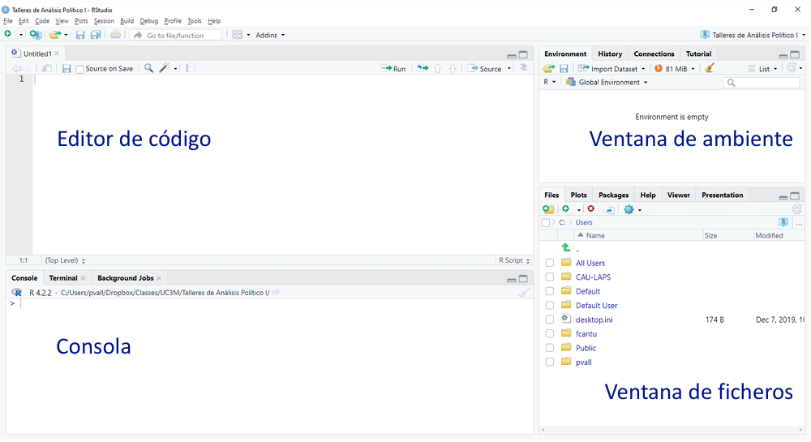

<style>
body {
text-align: justify}
</style>

```{r setup, include=FALSE, message=FALSE, warning=FALSE}
knitr::opts_chunk$set(echo = TRUE, message=FALSE, warning=FALSE,
                      fig.align = 'center', # Para que los gráficos de los comandos estén centrados en la página
                      out.width = '60%') # Para modificar el tamaño de los gráficos (en este caso hacerlos algo más pequeños)
```


```{r cosas previas include=FALSE}
setwd("C:/Users/Lenovo/OneDrive/Escritorio/Apuntes R")
library(tidyverse)
library(pacman)
source("00_datos/source.R")
```


# {.tabset .tabset-fade .tabset-pills}
## Introducción
#### R Studio

<center>

</center>

- Editor de código: ficheros donde se escribe el código. Elemento clave para la reproducibilidad.
- Consola: muestra los resultados del código ejecutado y permite ejecutar código de forma rápida (poco recomendable excepto para pruebas y mirar cosas muy concretas y rápidas) 
- Ventana de ambiente: muestra los objetos almacenados
- Ventana de ficheros/gráficos…
  - Permite visualizar resultados del trabajo: gráficos, html…
  - Encontrar ficheros
  - Ver detalles de los paquetes empleados, etc.

Existen diversos formatos para escribir código en R, siendo dos de los más destacados los siguientes:

- **Script**: útil si solo se quiere escribir código.
- **RMarkdown**: más util si se quieren añadir anotaciones de texto frecuentes. Además, cuenta con numerosas opciones extra, como añadir imagenes, tablas o guardar los documentos en formato pdf o html, entre otras funciones.

#### Instalar paquetes
Los paquetes son un conjunto de código, datos y documentación que permiten implementar funciones predefinidas extra.

**R básico**:

Para instalar un paquete, se puede hacer buscándola en la pestaña`Install` dentro de la pestaña `Packages` (esquina inferior derecha de la pantalla).

También se puede instalar usando el siguiente comando: `install.packages("nombre_librería")`

Una vez instalada, se abre usando el comando: `library("nombre_librería")`

IMPORTANTE: las librerías deben abrise siempre que se usen (no con cada comando que se use, sino con cada sesión de R que se abra), pero solo se instalan una vez.

**Librería pacman**:

1. Instalar la librería pacman.
2. Abrir la librería.
3. Cuando se vaya a abrir una nueva librería, en lugar de usar el comando `library("nombre_librería")` se usa `p_load("nombre_librería")`
    - La ventaja de este comando es que, en caso de que no esté instalada la librería, se descargará y abrirá directamenta.

**Paquetes de GitHub**:

Tanto `install.packages` como `p_load` sirven únicamente para paquetes que estén dentro de CRAN. Para instalar los que estén en GitHub se debe usar el comando `devtools::install_github("libraría")`, que pertenece a la librería `devtools`.


#### Recomendaciones
Al comenzar un nuevo trabajo en R, conviene crear un proyecto nuevo en el que se quiera trabajara, y mantener este ordenado. También es recomendable guardar todos los códigos de forma estructurada, de modo que tanto otras personas como tu yo del futuro puedan saber para qué sirven cada una de las cosas que se han añadido.


#### Atajos

- Añadir un **pipe** (%>%): ctrl + shift + m
- Añadir una almoadilla a la línea de código sobre la que se esté: ctrl + shift + c

**En RMarkdown**

- Añadir un nuevo chunl de r: ctrl + alt + i

**En un script**

- Crear nuevas secciones dentro del documento: ctrl + shift + r

***
## RMarkdown {.tabset .tabset-fade .tabset-pills}
### 1. Elementos básicos

**Yalm**

Se escribe al comienzo del documento, y establece las características básicas de este y como se va a guardar.

 <pre><code>---
 title: "El título del documento"
 subtitle: "El subtítulo"
 date: "Fecha"
 author: "Autor"
 output:
  html_document: #también se puede guardar como pdf o word, así saca una página web
    theme: united #es el tema del documento, hay diferentes
    toc: true #para crear una tabla de contenido
 ---</code></pre>

Muchos de estos elementos son opcionales, y se pueden añadir más.

Ejemplos de temas que se pueden utilizar para el documento: https://rpubs.com/ranydc/rmarkdown_themes

**Chunks**

Para escribir los códigos de R y que estos se puedan ejecutar, se debe añadir un chunk. Se puede hacer manualmente o mediante el atajo Ctrl + Alt + I.

Para ejecutar el códico que se escriba, se puede pulsar el triángulo verde de la esquina superior derecha (del chunk), la opción Run de la esquina de la pestaña del rmd, o usando Ctrl+Enter.

Dentro de los chunks, se pueden establecer diferentes opciones para que no se muestre el código en el documento final pero se ejecute igualmente, no se muestren los errores... Estos ajustes se puedes escribir como comandos dentro de {r} o en la rueda de opciones que aparece a la derecha de cada chunk.

Los chunks de R además permiten ejecutar todo el contenido de los chunks empleados con anterioridad, lo que puede resultar muy útil en el casdo de cometer errores que nedesitar resetear todo el trabajo realizado hasta el momento. Para ello, se debe seleccrionar la segunda opción que aparece en la esquina superior derecha del chunk (entre la rueda y el triángulo verde).

**Encabezados**

Sirven para delimitar los diferentes apartados y subapartados de los documentos. Se crean con las # (en una nueva línea se escribiría: # Encabezado de nivel 1). El espacio entre la almohadilla y el texto es imprescindible. Si en lugar de escribir una única # se ponen 2, 3... o 6, se van creando subniveles de encabezados (un mayor número de almohadillas indica un nivel inferior de encabezado).

**Espacio entre líneas**

Si se quiere añadir un salto de línea, se debe dejar una línea de código vacía entre los dos textos que se pretenden separar. Si simplemente se escribe en la siguiente línea, se compliará todo como parte del mismo párrafo.

**Compilar el documento**

Se selecciona la opción Knit, lo que genrará un documento HTML/PDF con todo el contenido y los resultados.

***
### 2. Opciones de texto y otros elementos
**Formatos de texto:**

* \*\*Texto en negrita** = **Texto en negrita** (los  asteriscos se pueden sustituir por _)
* \*Texto en cursiva* = *Texto en cursiva*
* \*\*\*Texto en negrita y cursiva*** = ***Texto en negrita y cursiva***
* \`Código subrayado\` = `Código subrayado`
* Subíndice: 3\~2~ = 3~2~
* Superíndice: 3\^2^ = 3^2^ 

**Listas:**

Para las listas de puntos, se escriben al comienzo de la línea de código y seguido de un espacio antes del texto un asterisco (*) o un guión (-). Además, si en la siguiente línea se añade espacio también antes del símbolo, se creará una sublista:

- Elemento 1
  - Elemento 2

También se pueden hacer listas con números y letras: 1. 1)  A. i. etc. 


**Ecuaciones**

Se escribe el texto de la ecuación entre dos símbolos del dolar. Ej.: \$E=mc^{2}\$ = $E=mc^{2}$

Si se quiere que la ecuación esté en un bloque a parte en lugar de dentro del texto, se añaden dos símbolos del dolar para abrir y cerrar la ecuación: $$E=mc^{2}$$


**Hipervínculos**

El texto para el que se quiere el hipervínculo se escribe entre corchetes, y a continuación (sin dejar espacios) se escribe entre paréntesis el enlace a la página para la que se quiere el hipervínculo. Ej.: \[Texto del hipervínculo]\(paginaweb.com)

**Añadir imágenes**

Hay varias opciones para insertar una imagen en el texto. Por ejemplo, puedes guardarla previamente en el directorio de trabajo (o en el proyecto que hayas creado). Una vez la tienes en tu directorio, puedes usar esta línea de código para introducirla en el documento final: ``. Además, se puede combinar con _center_ para centrar la imagen en el output, y con _width_ para ajustar el tamaño.

```r
<center>
{width=350px}
</center>
```

Otra manera sencilla de controlar el tamaño es usando porcentajes: `{width=10%}`

Una alternativa bastante usada, por ejemplo, es usar _include_graphics_ para controlar el ancho y alto de la imagen añadiendo como opción dentro de {r} lo siguiente: `out.width = "100px", out.height="300px"`

```r 
knitr::include_graphics("mi_imagen.png")
```

También tenemos la opción de introducir una imagen directamente desde la web (es decir, sin descargarla previamente). Primero, creamos una variable con la dirección url. Una vez creada la variable, se añade igual que una imágen guardada en el directorio:

```r
nombre_imagen<-"https://ejemplo_imagen.jpg" 
```


**Líneas horizontales**

Se añaden escribiendo en una línea vacía *** o ---. El resultado es:

***

Existen muchas otras opciones dentro del RMarkdown, como incluir tablas, citas, referencias... En el [enlace](https://rstudio.github.io/cheatsheets/html/rmarkdown.html) se puede encontrar información extra, aunque es solo un ejemplo de página sobre RMarkdown.

***
### 3. Índices y tablas de contenido {.tabset .tabset-fade .tabset-pills}
#### 2.1. Índice como lista al comienzo del documento

Los índices se crean a partir de los títulos (#). Se puede especificar el número de niveles que se quieren incluir gracias a la opcion`toc_depth`:

<pre><code> ---
title: "El título del documento"
output:
  html_document:
    toc: true
    toc_depth: 3 #En este caso se incluirían los tres primeros niveles del títulos (hasta ###)
--- </code></pre>

***
#### 2.2. Índice a la izquierda del documento

**Tabla de contenido despegable**

Para poder hacer una tabla de contenido despegable, se debe crear un css personalizado:

**Índice personalizable en RMarkdown**

Para crear un índice (TOC - Table of Contents) personalizable en RMarkdown que sea flotante y se pueda ocultar/mostrar, necesitamos añadir código CSS y JavaScript. Aquí te explico paso a paso cómo hacerlo.

**1. Código CSS necesario**

Primero, necesitas añadir este bloque de código CSS al inicio de tu documento. Este código dará estilo al índice y creará la funcionalidad de mostrar/ocultar:

<pre><code>```{css, echo=FALSE}
hr {
  border: none;
  border-top: 3px solid #bbb;
  margin: 1em 0;
}
 #TOC {
  position: fixed;
  left: 0;
  top: 0;
  width: 300px;
  height: 100%;
  overflow-y: auto;
  background: #f8f8f8;
  border-right: 1px solid #e7e7e7;
  padding: 20px;
  transition: left 0.3s ease;
}
 #TOC.hidden {
  left: -300px;
}
 #toggle-toc {
  position: fixed;
  top: 5px;
  left: 5px;
  z-index: 1000;
  background: #f8f8f8;
  border: 1px solid #e7e7e7;
  padding: 5px 10px;
  cursor: pointer;
}
.main-content {
  transition: margin-left 0.3s ease;
  margin-left: 200px;
}
.main-content.toc-hidden {
  margin-left: 150px;
}
@media (max-width: 767px) {
  .main-content {
    margin-left: 0;
  }
}
```</code></pre>

**2. Código JavaScript necesario**

Luego, necesitas añadir este bloque de código JavaScript que proporcionará la funcionalidad interactiva:

<pre><code>```{js, echo=FALSE}
$(document).ready(function() {
  var toc = $('#TOC');
  var toggle = $('<button id="toggle-toc">☰</button>');
  var mainContent = $('body > .main-container');
  $('body').prepend(toggle);
  mainContent.addClass('main-content');
  toggle.click(function() {
    toc.toggleClass('hidden');
    mainContent.toggleClass('toc-hidden');
  });
  // Inicializar el estado en pantallas pequeñas
  if ($(window).width() <= 767) {
    toc.addClass('hidden');
    mainContent.addClass('toc-hidden');
  }
});
```</code></pre>

**3. Configuración del YAML**

Además, asegúrate de que tu encabezado YAML incluya la opción de tabla de contenidos:

 <pre><code>---
title: "Tu título"
output: 
  html_document:
    toc: true
    toc_float: true
 ---</code></pre>

**4. Cómo funciona**

Este código creará:

* Un índice flotante en el lado izquierdo de la página

* Un botón (☰) en la esquina superior izquierda para mostrar/ocultar el índice

* El índice se ocultará automáticamente en dispositivos móviles

* Transiciones suaves al mostrar/ocultar el índice

**Nota:** El código CSS y JavaScript debe colocarse al principio del documento, después del encabezado YAML.

**Personalización**

Puedes personalizar el aspecto modificando los valores en el código CSS:

* Cambia `width: 300px` en `#TOC` para ajustar el ancho del índice

* Modifica `background: #f8f8f8` para cambiar el color de fondo

* Ajusta `margin-left` en `.main-content` para cambiar el espaciado del contenido principal

***
#### 2.3. Índice por pestañas
1. En el yalm no se escribe el toc: true
2. Tras el primer título (que se puede dejar en blanco escribiendo únicamente la #) se escribe el siguiente comando `{.tabset .tabset-fade .tabset-pills}`.
3. Esta opción se puede repetir para los sucesivos subniveles de títulos, creando nuevas pestañas dentro de cada pestaña (como en este archivo).

***
#### 2.4. Números de sección
En lugar de añadir a mano los números delante de cada título (1.2. Subtitulo), estos se pueden añadir automáticamente gracias a la siguiente opción:

<pre><code>---
title: "El título del documento"
output:
  html_document:
    toc: true
    number_sections: true
---</code></pre>

Si se utiliza esta opción, hay que comenzar los títulos por el primer nivel, porque si no en el segundo apareceran como 0.1 0.2 ...

***
### 4. Otras cosas RMarkdown

* Para escribir código de R sin que se ejecute (pero mostrándolo en el html), se borran las llaves que rodean la r del chunk:
  + Código que se ejecuta:

<pre><code>```{r}
Aquí iría el código
```</code></pre>

  + Código que no se ejecuta:

<pre><code>```r
Aquí iría el código
```</code></pre>

* **Crear índices a mano** (lista con hipervínculos)
  1) Junto a un título (para cualquier nivel de #), se escribe: {#nombre-sección}
  2) Donde se quiera crear el índice se pone el siguiente texto: [Nombre de la sección] (#nombre-sección) *Importante: no se debe dejar ningún espacio entre el corchete y el paréntesis*.


***
## Flujos de trabajo
El **directorio** de trabajo es el lugar donde R busca los archivos que le pides que cargue, y donde guardará los archivos que generes.

Para trabajar dentro de una carpeta del ordenador exiten dos opciones:
- Crear un nuevo proyecto y trabajar desde ahí.
- Establecer manualmente el directorio:
```r
setwd("dirección de la carpeta en el ordenador")
```

Para consultar los ficheros que hay dentro de nuestro directorio de trabajo podemos usar la función `dir()`
```r
dis()
```


### Source

Extraer el código a un script de R:

```r
knitr::purl("nombre_archivo.Rmd")
```

Ejecutar todo el código de un script sin mostrarlo:

```r
source("nombre_archivo.R")
```

Se escribe al principio del RMarkdown (o del script) para que ejecute directamente un script sin mostrar todo el código (en el environment) (importa el código sin mostrarlo todo).

Por ejemplo, puedes tener un script solo con la limpieza de la base de datos, y para que no sea tan largo y lioso el documento, ejecutarlo directamente y en el nuevo RM comenzar directamente con el análisis.

***
## Operaciones básicas  {.tabset .tabset-fade .tabset-pills}
### 1. Operaciones numéricas

- Suma, resta, multiplicación, división, exponencial...
- Cuadrado (sqrt) y logaritmos (log)
- Absoluto:
```{r}
abs(-1.4)
```
- Redondear: 
```{r}
round(1.234, 2) #El segundo número indica el número de decimales al que se redondeará.
```

***
### 2. Edición de caracteres (texto)

- Unión de caracteres:
```{r}
paste("Hola", "mundo", sep = " ")
paste0("Hola", "mundo")
```
- Seleccionar una parte del texto:
```{r}
substring("Nombre: Marga", first = 7, last = 11)
```
- Pasar un texto a minúsculas:
```{r}
tolower("Hola, soy Marga")
```
- Pasar un texto mayúsculas:
```{r}
toupper("Hola, soy Marga")
```
- Contar el número de caracteres (también espacios y símbolos, no solo letras):
```{r}
nchar("Hola, mundo!")
```

***
### 3. Operadores lógicos y relacionales
**Operadores lógicos:**

-   `!` NOT (lo opuesto)
-   `&` AND
-   `|` OR

**Operadores relacionales:**

-   `==` igual
-   `!=` distinto
-   `>` mayor que
-   `>=` mayor o igual que
-   `<=`menor o igual que
-   `<` menor que

### 4. Operaciones con vectores
Un vector es una secuencia de elementos del mismo tipo (numérico, carácter, lógico, etc.). Se puede asimilar a una variable.

- Ver de qué tipo es el vector: `class()`
- Comprobar la longitud del vector: `length()`
- Si los vectores son númericos, se les pueden aplicar las mismas operaciones que a los números (suma, multuplicaicón...), ya sea a un único vector o entre vectores (sumar un vector a otro). Ej.:
```{r}
vector1 <- c(1, 6, 4)
vector2 <- c(1, 2, 3)

vector1 + 10
vector1 + vector2
```
- Comparar dos vectores:
```{r}
vector1 == vector2
```
- Concatenar vectores: mismos comandos que para unir dos caracteres de texto. Ej.:
```{r}
paste(vector1, ":00", sep="")
paste(vector1, vector2, sep = " & ")
```
- Buscar si existe un valor concreto dentro de un vector. Ej.: 
```{r}
partidos1 <- c("PP", "PSOE", "SUMAR", "VOX")
partidos2 <- c("PP", "PSOE", "OTROS")
"VOX" %in% partidos1
"VOX" %in% partidos2
```
- Combinar vectores:
```{r}
long_vector <- c(partidos1, partidos2)
long_vector
```
- Conocer un elemento dentro de una posición concreta de un vector:
```{r}
num_vector <- 5:10
num_vector[3] # Elemento en la posición 3
num_vector[c(2, 4)] # Elementos en las posiciones 2 y 4
```
- Cambiar elementos específicos de un vector: 
```{r}
num_vector[c(2, 4)] <- c(13, 50)
num_vector
```
- Explorar los primeros y últimos valores de un vector:
```{r}
head(long_vector, 2) # devuelve los dos primeros
tail(long_vector, 3) # devuelve los tres primeros
```

***
## Ficheros de datos (dataframes) {.tabset .tabset-fade .tabset-pills}
### 1. Apertura de ficheros
Para poder abrir un fichero no basta con el comando, sino que estos se deben guardar dentro de un nuevo objeto:
```r
datos<- read_csv("filename")
```
<br>

**Ficheros de texto plano (.csv, .txt, tsv, etc)**
Se necisita abrir la librería readr: `library(readr)`. El comando a utilizar varía en función del separador del archivo:

- `read_csv()` para ficheros csv delimitados por coma (,).
- `read_csv2()` para ficheros csv delimitados por punto y coma (;).
- `read_tsv()` lee ficheros separados por tabulador
- `read_delim()` lee ficheros sin delimitador
- `read_fwf()` lee ficheros de ancho fijo
- `read_table()` lee ficheros separados por espacio

Si las columnas tienen nombre, se debe especificar dentro de la función:
```r
data<-read_csv("filename", col_names=FALSE)
```
<br>

**Ficheros de excel**
Cuando los datos están un fichero **.xlsx**, utilizamos función `read_excel()` del paquete **readxl**

Si los datos están la primera hoja del fichero *mi_excel.xlsx*

```r
library(readxl)
datos <- read_excel("mi_excel.xlsx", 1)
```

Si los datos están en una hoja llamada "mi_hoja"

```r
datos <- read.excel("mi_excel.xlsx", sheetName = "mi_hoja") 
```
<br>

**Lectura de datos desde ficheros SPSS, Stata y SAS **
Una de las opciones existentes es la función `haven()` del paquete **haven** nos permite abrir ficheros en formatoStata/SPSS/SAS. Por ejemplo:

```r
library(haven)
datos <- read_dta("filename.dta")
```
Las funciones `read_spss()` y `read_sas()` tienen la misma sintaxis.

<br>

**Apertura manual de los ficheros**

Cuando los ficheros se abren así, lo mejor es copiar el comando que se ha empleado y copiarlo en un chunk del rmd o el script en el que se esté trabajadno, para que cuando se quiera volver a abrir el archivo sea más rapido hacerlo.

***
### 2. Visualizar el contenido de un dataframe
- `View(datos)` → abre una nueva pestaña con la base de datos.
- `glimpse(datos)` (del paquete tydiverse) → muestra el número de filas y de columnas, el nombre de las variables, su clase y los primeros valores de cada una de ellas.
```{r echo=FALSE, warning=FALSE}
glimpse(select(datos, 1:10))
```
- `dim(datos)` → permite conocer el número de filas y de columnas.
```{r echo=FALSE}
dim(datos)
```
- `summary(datos)` → muestra los descriptivos principales de cada una de las variables del dataframe (media y cuartiles).
```{r echo=FALSE}
summary(select(datos, 1:5))
```
- `colnames(datos)` → lista con el nombre de todas las variables.
```{r echo=FALSE}
colnames(select(datos, 1:15))
```
- `describe(datos)` (del paquete psych).
```{r echo=FALSE, message=FALSE, warning=FALSE}
library(psych)
describe(select(datos, 1:10))
```
- `str(datos)` → metadatos de cada una de las variables (lo que sale si le das al triángulo verde que aparece junto al nombre de la base de datos del environment).
```{r echo=FALSE}
str(select(datos, 1:5))
```
- `head(datos, 10)` → muestra las variables, su clase, los 10 primeros valores de cada uno de ellos.
```{r echo=FALSE}
head(datos,10)
```
***
### 3. Modificar el fichero
#### Ordenar las variables

**Variable numérica:**

- Orden ascendente:
    + Opción 1: `datos %>% arrange(variable)`
    + Opción 2: `datos <- datos[order(datos$variable), ]`
- Orden descendente:
    + Opción 1: `datos %>% arrange(desc(variable))`
    + Opción 2: `datos <- datos[order(-datos$variable), ]`
- Se pueden ordenar los datos por dos variables simultáneamente: 
    + Opción 1: `datos <- datos %>% arrange(var1, var1)`
    + Opción 2: `datos <- datos[order(datos$var1, datos$var2), ]`

**Variable categórica:**

- Se usan los mismos comandos anteriores para ordenar por orden alfabético ascendente o descendente
- Orden personalizado: `mutate(variable = fct_relevel(variable, c("categoría1", "cat2", "catn")))` Ej.:
  ```r
  mutate(partido = fct_relevel(party, c("PP", "PSOE", "VOX", "SUMAR", "Otros")))
  ```
<br>

#### Seleccionar (y eliminar) variables
Seleccionar una columna:
```{r}
select(Datos, age)
```

Seleccionar varias columnas: 
```{r}
select(Datos, name, sex, age)
```


Crear un nuevo data.frame con una selección de columnas. Esto es muy útil cuando tenemos datasets con muchas variables y queremos trabajar con algo más manejable:
```{r}
Nuevos_Datos <- select(Datos, name, sex, age) 
head(Nuevos_Datos, 10)  # visualizamos el nuevo dataset
```

Tambiéns se pueden eliminar una o varias variables que no se quieran en el dataset:
```{r}
Nuevos_Datos2 <- select(Datos, -name) 
head(Nuevos_Datos2, 10)
```


*Dataframe original, para comparar las diferencias:*
```{r echo=FALSE}
head(Datos, 10)
```


***
## Edición de variables  {.tabset .tabset-fade .tabset-pills}
### 1. Renombrar una variable
**Opción 1**:
```r
Datos <- rename(Datos, nombre_nuevo = nombre_viejo)
```
**Opción 2**:
```r
datos <- datos %>% rename(nombre_nuevo = nombre_viejo)
```
Se puede cambiar el nombre de varias variables a la vez:
```{r}
colnames(Datos)

Datos<-Datos %>% rename(
  clase=pclass,
  nombre=name,
  sexo=sex,
  edad=age)
```

```{r}
colnames(Datos)
```


***
### 2. Recodificar una variable (o crear una nueva)
*(Tanto `mutate` como `case_when` son comandos de la librería dplyr, que se incluye dentro del tidyverse)*

Antes de recodificar una variable es necesario conocer cómo es la variable. Para ello:

1. Se mira de qué tipo es la varible (numérica -numeric/dbl- o factor) gracias al comando `class`:
```{r}
class(Datos$edad)
```
2. Tambien conviene realizar una tabla para conocer el contenido de la variable, así como su distribución: 
```{r}
table(Datos$clase, useNA="ifany") #La opción useNA="ifany" es opcional, y se añade para que en la tabla se muestren también los valores perdidos.
```
<br>

**Recodificar con el comando case_when**

```r
Datos <- Datos %>%
  mutate(edad = case_when(
    edad == 29 ~ 30, # reemplaza 29 por 30
    edad == 2 ~ 3, # reemplaza 2 por 3
    TRUE ~ edad)) # Mantiene iguales los valores que no cambian.
```

```{r}
Datos <- Datos %>%
  mutate(clase_rec = case_when(
    clase %in% c(2, 3) ~ 0, # Si 'clase' es 2 o 3, asigna "0"
    TRUE ~ clase)) 

table(Datos$clase_rec)
```
La opción TRUE en este comando significa "todos los demás valores". Si no se añadiera, todos los valores que no coinciden con las condiciones se enviarían a perdidos (NA).

<br>

**Recodificar con el comando ifelse**

El comando ifelse es una secuancia lógica con tres elementos. Un primer número, que es la categoría que se quiere transformar, un segundo número, que es en el que se transforma, y una tercera condición para el resto de valores. Esta puede ser otro número, NA o otra secuencia de ifelse.
```r
Datos <- Datos %>%
  mutate(edad = ifelse(edad == 29, 30, ifelse(edad == 2, 3, edad)))

Datos <- Datos %>%
  mutate(clase_rec2 = ifelse(clase == 1, 1,
                             ifelse(clase %in% c(2, 3), 0, NA)))
```
<br>

Las **variables categóricas** se recodifidan del siguente modo:

1. Transformándolas en una variable numérica:
```r
#Por separado:
Datos <- Datos %>% 
  mutate(sexo = as.numeric(sexo)) %>% 
  mutate(sexo = case_when(
    sexo == 1 ~ 0,
    sexo == 2 ~ 1,
    TRUE ~ sexo
  ))
  
#A la vez:
Datos <- Datos %>% 
  mutate(as.numeric(sexo) = case_when(
    sexo == 1 ~ 0,
    sexo == 2 ~ 1,
    TRUE ~ sexo
  ))
```
*Es la opcion más útil si se quiere modificar una variable con muchas categorías*

2. Escribiendo las etiquetas entre "":
```r
Datos <- Datos %>%
  mutate(sexo = case_when(
    sexo == "female" ~ "mujer",  
    sexo == "male" ~ "hombre",   
    TRUE ~ sexo                  
  ))
```
*Esta opción es la más cómoda si la variable tiene pocas categorías.*

3. Especificando los niveles que se quieren modificar:
```r
datos <- datos %>%
  mutate(estudios_universitarios = case_when(
    estudios %in% levels(estudios)[1:5] ~ 0,  # Agrupar niveles 1 a 5 en 0
    estudios %in% levels(estudios)[6] ~ 1,    # Agrupar nivel 6 en 1 
    TRUE ~ NA_real_                           
  ))
```
*Esta opción es util si se quiere convertir en dicotómica una variable categórica con muchas categorías, aunque la primera opción es igual de buena en estos casos*

<br>

Otros **ejemplos** de recodificar variables:

- Se pueden utilizar símbolos lógicos como el >,<,|,& etc a la hora de recodificar variables
```r
datos<-datos %>%
  mutate(recuerdo19 = ifelse(recuerdo19 >= 9977, NA, recuerdo19))
```


***
### 3. Añadir etiquetas a la variable
Ver las etiquetas de una variable: `attr(datos$var, "labels")`:

**Para cambiar las etiquetas se usa el comando factor** *(de dyplr)*
```r
datos <- datos %>% 
  mutate(variable = factor(variable, 
                    levels = c(1,2,3),
                    labels = c("Etiqueta1","Etiqueta2","Eriqueta3")))
```
- `levels` = c(1,2,3) indica el conjunto de números correspondientes con los valores de cada categoría de la variable.
- `labels` =c("Etiqueta1"...) indica las etiquetas correspondientes con cada valor especificado anteriormente. Por ejemplo, en este caso a la categoría de la variable que se identifica con un 1 se le asignaría la etiqueta "Etiqueta1".
- Ej. de cómo añadir etiquetas:

```{r}
table(datos$mujer)

datos <- datos %>%
  mutate(mujer = factor(mujer, levels = c(0, 1), labels = c("Hombre","Mujer"))) 

table(datos$mujer)
```


Si se quiere etiquetar algún carácter de una variable numérica sin transformarla en factor, se puede usar el siguiente comando:

```r
library(labelled)
val_labels(datos$variable) <- c(Etiqueta1 = 0, Etiqueta2 = 1)
```

Este comando también es útil en el caso de escalas: por ejemplo, en la escala de ideología del 1 al 10 para poner que el 1 es extrema izquierda y el 10 extrema derecha, pero dejarlo como numérico y sin necesidad de etiquetar todas las categorías.
```{r include=FALSE}
library(labelled)
```

```{r}
class(datos$ideol)

val_labels(datos$ideol) <- c(Extrema_izq = 1, Extrema_dcha = 10)

class(datos$ideol)
val_labels(datos$ideol)
```

***
## Análisis descriptivo  {.tabset .tabset-fade .tabset-pills}
### 1. Estadísticos básicos

Lista con los estadísticos descriptivos básicos: `summary()`
```{r}
summary(datos$edad)
```

También se puede obtener un único estadístico de interés: `min()`, `max()`, `median()`, `mean()`, `sd()`

***
### 2. Tablas de frecuencias

Con el comando `table`:
```r
table(datos$variable)
```

* Ej.:

```{r}
table(datos$estudios)
```

Si queremos ver también los valores perdidos de la variable, se añade al comando original la opción `useNA = "ifany"`: 

```{r}
table(datos$estudios, useNA = "ifany")
```
<br>

Con el comando `count`:
```r
datos %>% count(variable)
```

* Ej.:
    
```{r}
datos %>% count(estudios)
```


*La explicación de cómo hacer tablas de frecuencias bivariadas, así como su interpretación, está en el apartado de análisis bivariado*

***
## Análisis bivariado  {.tabset .tabset-fade .tabset-pills}

### 1. Prueba estadística para la diferencia de medias (T-test) {.tabset .tabset-fade .tabset-pills}

#### 1.1. En R

**Test de una media**: 

El objetivo de este tipo de test es comprobar si la media poblacional de una variable se corresponde con una determinada cifra.
```r
t.test(datos$variable, mu = 5, conf.level = 0.99)
```

- `mu = número` es donde se indica el valor de la media para el cual se quiere comprobar si la media poblacional es significativamente distinta. Es decir, si se quiere comprobar si la media es igual a 5, se escribirá `mu = 5`.
- `conf.level` sirve para establecer un intervalo de confianza específico. Si no se añade esta opción, el intervalo será al 95%.

```{r}
t.test(datos$ideol, mu=5.5)
```
En este caso, se puede decir que al 95% de confianza la media ideológica de la población es distinta de 5.5 (en una escala del 1 al 10). Se sabe por tres motivos:

- El p-value es < de 0,05
- El valor de t < -1,96
- En el intervalo de confianza no se incluye el 5.5

*La explicación del por qué está en el apartado de la teoría*

<br>

**Test de proporciones**: para variables dicotómicas. 

Lo que se intenta con este tipo de test no es comprobar si una determinada cifra se incluye dentro de la media poblacional, sino si una variable alcanza un determinado porcentaje. 

P.ej., para saber si el PP puede alcanzar un 35% de los votos, se crea una variable dicotómica donde 0 es no votarlo y 1 sí. Después, se hace un ttest como el anterior, pero en el mu se especifica el porcentaje que se quiere comprobar si se alcanza (0.35 en este caso).
```{r}
t.test(datos$intvoto_pp, mu=0.35)
```
Los resultados se interpretan igual que en el test de una media.

<br>

**Test de dos medias** 

La hipótesis nula en este tipo de prueba es que las dos medias son iguales y la hipótesis alternativa es que no lo son.
```r
t.test(datos$var1 ~ datos$var2)
```
- `var2` es la variable dicotómica que divide a la muestra en los dos grupos de interés, para los cuales se tratará de averiguar si la media de la
- `var1` (variable numérica) es igual en ambos o no.

```{r eval=TRUE}
t.test(datos$ideol ~ datos$hombre)
```
Los resultados indican que la media de ideología de las mujeres en la muestra es 4.75 y la de los hombres 4.87. Esta diferencia es suficiente para rechazar la Ho, es decir, no existen diferencias significativas en la ideología en función del género.

<br>

**Comparación de medias para dos variables numéricas**

Si son **muestras independientes**:

```r
t.test(datos$variable1, datos$variable2)
```


En el caso de **muestras dependientes**, el comando es el siguiente: 
```r
t.test(datos$variable1, datos$variable2, paired = TRUE)
```
La prueba t pareada se utiliza cuando las medias que estamos comparando no son independientes. En otras palabras:

- Correnponden al mismo conjunto de sujetos en dos momentos diferentes (por ejemplo, antes y después de un tratamiento).
- Se comparan dos variables medidas en las mismas personas o unidades (las mismas personas opinan o responden sobre dos cosas diferentes).

Ej.: comprobar si las personas tienen la misma probabilidad de votar al PP y VOX:
```{r}
t.test(datos$prop_vox, datos$prop_pp, paired=TRUE) 
```

<br>

*Cálculo manual de los intervalos de confianza:*

La fórmula de los intervalos es: media muestral ± valor crírico (σ)*error estandar

Para calcular el error, se utiliza el comando `std.error`de la librería `plotrix`:
```r
std.error(datos$variable)
```
```{r include=FALSE}
library(plotrix)
```
En el ejemplo usado en el test de una media, el error se calcularía del siguiete modo:
```{r}
std.error(datos$ideol)
```
El error estándar es 0.016. De acuerdo con esto, al 95% los intervalos serían:

- Intervalo superior: 4.815857 + 1.96*0.01568334 = 4.775456
- Intervalo inferior: 4.815857 - 1.96*0.01568334 = 4.856257


***
#### 1.2. Teoría
A la hora de iterpretar los resultados de una prueba estadística, podemos fijarnos en tres cuestiones (relacionadas entre sí): el valor crítico, el nivel de significatividad o alpha y el intervalo de confianza.

- *Nivel de confianza*: es la probabilidad de que el parámetro a estimar se encuentre en el intervalo de confianza.
- *Alpha*: es la probabilidad de quedarse fuera de ese intervalo (en términos sustantivos, la probabilidad de rechazar la hipótesis nula cuando es cierta.
- *Valor crítico*: indica el número de desviaciones estándar que cubren el área bajo la curva para un determinado nivel de confianza. Por ejemplo, para un IC del 95%, este valor crítico indica los límites dentro de los cuales se encuentra el 95% de las observaciones en una distribución normal. Establece donde empieza y dónde termina la zona de rechazo de la hipótesis.


|Nivel de confianza|Alpha|Valor crítico|
| :---: | :----: | :----: |
|95%|5 - 2,5%|1,96|
|99%|1 - 0,5%|2,57|
|99,9%|0,1 - 0,05%|3,27|


<center>
{width=320px}
</center>

El *intervalo de confianza* indica, para un determiando nivel de confianza, el rango en el que se moverá la media real de un determinado rasgo para el universo estudiado, mientras que la media que se puede calcular a partir de una muestra indica únicamente el valor medio del rasgo de esa muestra. Es decir, si tomamos un intervalo de confianza del 95%, en el 95% de ocasiones la media real del universo de estudio se moverá entre los límites establecidos por el intervalo de confianza. Se emplean estos intervalos ya que la única forma de conocer el valor medio real de un determinado rasgo de una población completa es mediante un censo en el que se incluya a toda esa población, pero es imposible de conocer de forma exacta tomando solo una muestra poblacional.

Por ejemplo, si para la media idológica tenemos un intervalo que va del 4,5 al 5 para un nivel de confianza del 95%, lo que quiere decir es que, en el caso de realizar 100 encuestas independientes a una población, en 95 de estas encuestas la media muestral tendrá un valor situado entre el 4,5 y el 5, y en otros 5 caso será superior o inferior a estas cifras. 


***
### 2. Análisis de correlación  {.tabset .tabset-fade .tabset-pills}

#### 2.1. En R
Los análisis de correlación buscan averiguar si existe relacion entre dos variables continuas.

<br>

**Covarianza:** 
```r
cov(datos$var1, datos$var2)
```
Ej. Se quiere comprobar la relación entre en índice de corrupcion de un páis (*cpi*, donde 0=más corrupto; 10=menos corrupto) y el índice de desarrollo humano (*hdi*, donde 0=más bajo; 1=más alto).
```{r message=FALSE, warning=FALSE}
cov(data$cpi, data$hdi)
```
<br>

**Correlación de Pearson:** 

La funión para calcular la correlación es `cor()` *(funciona igual que el comando cov)*. Sin embargo, para poder interpretar más adecuadamente los resultados de la correlacion conviene realizar un test para comprobar si dicha correlación es estadísticamente significativa. Las hipótesis de este test son:

* H~0~= la correlación es igual a 0, así que no hay relación
* H~1~= la correlación es significativamente distinta de 0

```r
cor.test(datos$var1, datos$var2)
```
Ej.:

```{r}
cor(data$cpi, data$hdi) # devuelve el valor de la correlación
cor.test(data$cpi, data$hdi) # hace un test
```
Los resultados muestran que la correlación entre ambas variables tiene un valor de 0,72. El test arroja tres resultados:

* t=13,186 --> t>3,26
* p<2.2e-16 --> p<0,001
* IC= [0.6406049, 0.7902298]

Basándonos en estos resultados, podemos rechazar la hipótesis nula y afirmar que la correlación es significativamente distinta de cero para un nivel de confianza del 99,9%

<br>

**Correlación de más de dos variables a la vez:**
```{r include=FALSE}
#Para estos ejemplos se usa la base de datos mtcars, que viene incluída con R.
attach(mtcars)
Data <- mtcars
```

1. Correlación entre todas las variables del dataset. Es fundamental que sean TODAS numéricas.

```{r}
cor(Data)
```

2. Si solo se quiere la relación entre varias variables concretas, se puede hacer de forma manual del siguiente modo:

```{r}
x <- Data[c(1:3, 5)]
y <- Data[6:8]
cor(x, y)
```
<br>

**Visualización de correlaciones:**

Además de usar funciones de cálculo, suele ser de gran ayuda visualizar las correlaciones entre variables gráficamente.

- Nube de puntos (dos variables): 
```{r}
plot(data$cpi, data$hdi, #Los datos que se van a usar para hacer el gráfico
     main = "CPI/HDI", #El título del gráfico
     xlab = "Corruption perception index", #El texto del eje X
     ylab = "Human development index", #El texto del eje Y
     pch = 18) #Establece la forma de los puntos (triángulos, círculos, x...)
```
  
- Correlaciones para más de dos variables a la vez: 

```r
library(corrgram)
corrgram(datos)
```
Ej.:
```{r include=FALSE}
library(corrgram)
```
```{r}
corrgram(Data)
```

*El comando cuenta con numerosas argumentos extra para modificar y mejorar la visualización del gráfico final (ver ?corrgram). P. ej.:*
```{r}
corrgram(Data, order=TRUE, lower.panel=NULL,
         upper.panel=panel.pie, text.panel=panel.txt,
         main="Car Milage Data in PC2/PC1 Order")
```

***
#### 2.2. Teoría
Si queremos analizar la dependencia entre dos **variables continuas** XX e YY, no podemos estudiar sus distribuciones por separado, sino que debemos hacerlo de manera conjunta. Para ello, definimos una variable estadística bidimensional (X,Y)(X,Y), cuyos valores serán todos los pares formados por los valores de las variables XX e YY.

La representación gráfica más utilizada para examinar la relación entre dos variables numéricas es el diagrama de dispersión. Este consiste en representar, sobre un plano cartesiano, los puntos correspondientes a los pares de valores ($x_{i}$, $y_{i}$) de la variable bidimensional. Estas nubes de puntos nos permiten visualizar el tipo de relación existente entre las variables (lineal, exponencial, positiva, negativa, etc.). Si además queremos cuantificar la intensidad de dicha relación, es necesario recurrir a medidas estadísticas, como la covarianza muestral o el coeficiente de correlación.

La **covarianza** de una variable bidimensional se obtiene promediando los productos de las desviaciones de cada valor con respecto a las medias de XX e YY. Una vez calculadas las medias, podemos calcular la covarianza siguiendo la siguiente fórmula:

$$cov_{x,y} = \frac{\sum\limits_{i=1}^{n}{(x_i-\overline{x}) \cdot (y_i-\overline{y})} }{n-1}$$

El valor de la covarianza nos indica lo siguiente:

* Si cov>0, relación lineal creciente entre las variables
* Si cov<0, relación lineal decreciente entre las variables
* Si cov=0, no existe relación lineal entre las variables

El problema de esta medida es que depende de las unidades. Imaginemos que las unidades de la variable x son _cm_ y las de la variable y son _gr_. En este caso, las unidades de la covarianza serán _cm × gr_, y si cambiamos la escala de las variables, la covarianza también cambiará. Esto hace que el valor de la covarianza sea difícil de interpretar. (la variazna es la distancia de los puntos hacia los ejes. La covarianza es la distancia de los puntos entre sí)

Para evitar este problema, es recomendable utilizar una medida normalizada, como el coeficiente de **correlación de Pearson**, que toma valores entre -1 y 1, donde:

* ρ =  1 indica una relación lineal perfecta y positiva
* ρ = -1 indica una relación lineal perfecta y negativa
* ρ =  0 indica ausencia de relación entre las variables

$$\rho = \frac{\text{cov}(X,Y)}{\sigma_x \sigma_y}$$

**Correlación no implica causalidad**

La correlación entre dos variables v1 y v2 puede deberse a:

* Relación causal: V1 es la causa, V2 el efecto (o viceversa)
* Azar
* Variable interviniente (confounding factor):
    + [Relaciones espúreas](http://www.tylervigen.com/spurious-correlations): es una correlación aparente entre dos variables que en realidad es causada por la influencia de una tercera variable, conocida como variable de confusión. Aunque las dos variables parecen estar relacionadas, su relación no es causal.
    + [Paradoja de Simpson](https://upload.wikimedia.org/wikipedia/commons/f/fb/Simpsons_paradox_-_animation.gif): ocurre cuando una tendencia observada en varios grupos desaparece o se invierte al combinar los datos de esos grupos. Esto sucede debido a la influencia de una variable oculta o de confusión que afecta la interpretación de la relación entre las variables. Aquí tenéis un [ejemplo muy conocido](https://rpubs.com/dawnwp/1081716).

***
### 3. Tablas de contingencia {.tabset .tabset-fade .tabset-pills}

#### 3.1. En R
Permite conocer la relación existente entre variables categóricas. Para ello nos valemos de las tablas de contingencia, donde se muestran las frecuencias de dos variables.

**La función table()**

1. Crear la tabla con las dos variables y guardarla: 
```r
tabla <- table(datos$var1, datos$var2)
```
Ej.: 
```{r}
tabla <- table(datos$situ_lab, datos$hombre)  # (filas, columnas)
tabla
```

*La primera var son las filas de la tabla y la segunda las columnas. La variable con menos categorías se pone en las columnas porque así es más sencillo de visualizar e interpretar, creando una tabla que se extiende de forma vertical en lugar de horizontal (mejor la primera tabla que la segunda).*

2. Crear la tabla de frecuencias:

- `prop.table(tabla)` #porcentaje de tabla (el % sobre el total)
- `prop.table(tabla, 1)` # porcentajes de fila (el 100% lo suman las filas)
- `prop.table(tabla, 2)` # porcentajes de columna (el 100% lo suman las columnas)
Para leer estas tablas adecuadamente, hay que fijarse si el 100% lo suman las filas, las columnas o toda la tabla.

Ej.:
```{r}
prop.table(tabla)   
```
Indica el porcentaje de cada subgrupo sobre el total de la muestra. Por ejemplo, de esta tabla se puede deducir que del total de la población un 25% son mujeres trabajadoras.
```{r}
prop.table(tabla, 1)
```
Indica la composición de género de cada una de las situaciones laborales. Por ejemplo, de los trabajadores un 44% son mujeres y un 56% hombres.
```{r}
prop.table(tabla, 2)
```
Inidca el perfil laboral dentro de cada género. Por ejemplo, un 54% de las mujeres son trabajadoras, mientras que un 63% de los hombres son trabajadores.

<br>

**Otras tablas: xtabs vs CrossTable** (mejor usar esta)

* `xtabs()`:

```r
tabla2 <- xtabs(~var1+var2, data = datos) #Crear y guardar la tabla
ftable(tabla2) #Visualizar la tabla
summary(tabla2) #Para ver los estadísticos de la tabla (como el chi2 y el p-valor)
```
Ej.:
```{r}
tabla2 <- xtabs(~situ_lab+hombre, data=datos)
ftable(tabla2) 
summary(tabla2) 
```

* `CrossTable()`:

```r
library(gmodels)
tabla3 <- CrossTable(datos$var1, datos$var2, #Las variables
                     digits = 1, #El número de decimales de la tabla
                     #Otras opciones de la tabla,
                     format = "SPSS") #El formato de salida de la tabla
```
```{r include=FALSE}
library(gmodels)
```
Ej.:
```{r}
CrossTable(datos$situ_lab, datos$hombre, digits=1, expected=T, asresid=TRUE, chisq=TRUE, prop.chisq=F, format="SPSS")
```
*Para comprobar qué opciones se pueden aplicar a la tabla, conviene mirar `?(CrossTable)`*

Ej. de interpretación de los residuos ajustados: en la celda de mujer y trabajadoras, los residuos ajustados son de -17,9. Esta cifra es inferior a -3,27, por lo que podemos decir que con un nivel de confianza del 99,9% las mujeres se encuentran infrarepresentadas (el símbolo es negativo) dentro del grupo de los trabajadores.

***
#### 3.2. Teoría
Las hipótesis a comprobar en una tabla de contingencia son: 

* H~0~= no existe asociación entre las variables (son independientes)
* H~1~= sí existe asociación entre las variables

Para saber si existe relación entre las bariables debemos fijarnos en:

<br>

**El análisis de los residuos**

A la hora de examinar la asociación entre variable categóricas es importante diferenciar entre:

* Frecuencia observada: la frecuencia en la muestra
* Frecuencia esperada: la frecuencia que observaríamos en el caso de que __no hubiera relación entre las 2 variables__
* Residuo: diferencia entre el valor observado y el esperado, que manifiesta dependencia entre pares de valores cuando es distinto de cero. Cuanto mayor sea el residuo, mayor será la probabilidad de que la muestra provenga de una población en la que las variables estén relacionadas. Para determinar si el valor de los residuos es significativo, es necesario estandarizarlos.

Si el residuo ajustado es mayor (en términos absolutos) que el valor crítico para un determinado nivel de confianza (1,96 para el 95%), se puede decir que la diferencia entre los valores esperados y los ajustados para una celda concreta de la tabla es significativa. En función de si el signo de estos residuos es positivo o negativo, sabremos si la relación establecida en la celda es de sobrerrepresentación dentro de la muestra (signo +) o de infrarrepresentación (signo -). *(Hay un ejemplo de esto al final de la explicaicón de CrossTables en R)*

<br>

**Chi2**

El chi-cuadrado (χ²) es una prueba estadística que se utiliza para comparar frecuencias observadas con frecuencias esperadas, a fin de determinar si hay una diferencia significativa entre ellas. Se emplea comúnmente para analizar tablas de contingencia y evaluar si dos variables categóricas están relacionadas. El𝜒2 se define como: 

$$\chi^2 = \sum \frac {(O - E)^2}{E}$$
Donde:

* O = Frecuencias observadas
* E = Frecuencias esperadas 

Por ser suma de cuadrados, se cumple que 𝜒2≥0:

* 𝜒2=0 cuando las variables son independientes
* 𝜒2 crece a medida que aumenta la dependencia entre las variables

Sabemos que el valor de chi-cuadrado (χ²) es lo suficientemente alto para ser significativo comparándolo con un valor crítico de una tabla de chi-cuadrado, o mediante su p-valor.


***

## Regresiones {.tabset .tabset-fade .tabset-pills}
### Lineal {.tabset .tabset-fade .tabset-pills}
#### En R
La regresión lineal se usa para predecir el valor de una variable **y** en función de una o más variables **x**. La variable dependiente debe ser numérica, y las independientes pueden ser tanto numéricas como categóricas. *En el ejemplo usado, se tratará de comprobar si el Índice de Corrupción de un país (y) depende del nivel de PIB de este (x).*

A la hora de realizar un análisis de regresión adecuado se deben seguir los siguientes pasos:

1. [Análisis preliminar](#preliminar)
2. [Realizar el modelo de regresión](#modelo)
3. [Interpretar los resultados](#resultados)
4. [Supuestos del modelo](#supuestos)
5. [Exportar los resultados](#exportar-resultados)

<br>

##### Resumen de las funciones principales
```r
# Análisis preliminar:
scatter.smooth(x=datos_reg$var1, y=datos_reg$var2) #Gráfico de dispersión
boxplot(datos_reg$var1, sub=paste("Outlier rows:  ", boxplot.stats(datos_reg$var1)$out)) #Boxplot para buscar datos atípicos
ggplot(datos_reg, aes(var1)) + geom_density(fill="red", alpha=0.8) #Diagrama de densidad (librería ggplot)

# Función de la regresión
regresión <- lm(var1~var2, datos_reg) #Librería e1071
summary(regresión)

# Comprobación de los supuestos principales
plot(regresión,2) #Normalidad de los residuos
bptest(regresión) #Homocedasticidad (librería lmtest)
vif(regresión) #Multicolinealidad (librería rms)

#Exportar los resultados
stargazer(regresión, type="text") #Librería stargazer
```

<br>

##### Análisis preliminar {#preliminar}

Antes de estimar la regresión, es importante explorar y entender la variable dependiente (fenómeno que queremos explicar). 

1. **Gráfico de dispersión**: permite visualizar la relación lineal entre la variable independiente y la dependiente. (Es una línea de tendencia, no un gráfico de dispersión, por eso la línea no es recta)

```{r}
scatter.smooth(x=datos_reg$gdp, y=datos_reg$cpi, main="GDP ~ CPI", xlab="GDP", ylab="CPI")
```

2. **Boxplot**: permite detectar la presencia de observaciones atípicas (outliers). Los valores atípicos pueden afectar a la predicción, modificando la dirección/pendiente de la recta de regresión.

```{r}
boxplot(datos_reg$gdp, main="GDP", sub=paste("Outlier rows:  ", boxplot.stats(datos_reg$gdp)$out)) 
```
  
  + Si se quiere comprobar con qué caso se corresponden los valores atípicos detectados se puede usar el siguiente comando:
  
```{r}
# Seleccionamos el nombre del país cuyo GDP es igual a 30491.34375
outlier_gdp <- datos_reg %>%
  filter(gdp == 30491.34375) %>% 
  pull(cname)
table(outlier_gdp)
```

3. **Diagrama de densidad**: para ver la distribución de la variable. Idealmente, la distribución ha de ser cercana a la normal. Si esto no ocurre, será necesario realizar alguna transformación en los datos empleados.
```{r warning=FALSE}
ggplot(datos_reg, aes(cpi)) + geom_density(fill="red", alpha=0.8)
```
<br>

##### El modelo de regresión {#modelo}

La función utilizada para construir modelos lineales es `lm()` del paquete `e1071`, que toma dos argumentos principales: `lm(var_dependiente ~ var_independiente, datos)`

```{r}
library(e1071)
reg.lineal <- lm(cpi~gdp, data=datos_reg) #El argumento "data=" se puede omitir, basta con poner la base de datos. Es decir, se puede escribir directamente: lm(cpi~gdp, datos_reg)
reg.lineal #Conviene guardar las regresiones dentro de un objeto, ya que de otra forma no se podrían realizar los pasos posteriores.
```
<br>

##### Los resultados de la regresión {#resultados}

Para evaluar los resultados, imprimimos las estadísticas de resumen para el modelo:
```{r}
summary(reg.lineal)
```

* Los **coeficientes** indican la contribución de cada variable independiente al modelo de regresión. 
  + **Intercept**(β~0~). Establece el valor de la variable y cuando la varible x es 0 (el punto donde la recta de regresión corta la ordenada en el orígen). En el *ejemplo*, el intercepto (β0)= 24.237, lo que significa que, para un país con GDP=0, el valor de su cpi sería 24.237.
  + El *coeficiente* de la variable independiente: establece el incremento promedio que experimentará la variable dependiente (y) por cada unidad que se incremetne la variable independiente (x). En el ejemplo, el coeficiente del gdp (β1)=0.002163, lo que significa que por cada incremento de un dolar en el gdp de un país, el cpi aumenta en 0.002163 puntos.
* La evaluación de la **significatividad** de los coeficientes (βi) comienza con la definición de hipótesis sobre los valores de los parámetros poblacionales:
  + Hipótesis nula: H0: βi=0 (el valor del coeficiente en la población es 0).
  + Hipótesis alternativa: H1: βi≠0 (el valor del coeficiente en la población es distinto de 0).
  + En el summario de la regresión, se puede comprobar observando el valor de la columna con *t value* (muestra la prueba t asociada a cada  β~i~) o el *p-valor* de la columna Pr (> | t |).
* La **bondad de ajuste** del modelo (R^2^) mide el porcentaje de varianza de la variable dependiente (Y) que queda explicado con nuestro modelo. Varía entre 0 y 1, y puede interpretarse como un porcentaje. Sin embargo, a medida que agregamos nuevas variables al modelo, el valor R-Squared será mayor. *Adj R-Squared* penaliza por el número de parámetros en el modelo. Por lo tanto, al comparar modelos anidados, es una buena práctica observar el valor de R^2^ ajustado sobre R^2^. *En el ejemplo, podemos decir que un 74,67% de la variación en el índice de corrupción se puede explicar gracias a las diferencias en el PIB*.
* La **significatividad del modelo** (F de Snedecor). Un F estadísticamente significativo significa que al menos uno de los coficientes es estadísticamente significativo. Es decir, que nuestro modelo predice mejor que un modelo sin variables.

<br>

##### Diagnóstico de la regresión (comprobaicón de los supuestos) {#supuestos}

1. **Linealidad**. El supuesto de linealidad puede ser comprobada con un gráfico de Residuos vs Valores Predichos.La línea horizontal, sin patrones distintivos en los puntos, indica una relación lineal.
 
```{r}
plot(reg.lineal, 1)
```

2. **Normalidad de los residuos**.
  i. El gráfico QQ de residuos puede usarse para comprobar visualmente el supuesto de normalidad. En este gráfico, los residuos debería seguir aproximadamente una línea recta.

```{r}
plot(reg.lineal, 2)
```

  ii. Cuando la visualización no es clara y tenemos dudas, podemos hacer un test. Por ejemplo, el de Shapiro-Wilk. La Ho en este test es que los residuos están normalmente distribuidos (lo que queremos). El problema de este test es que está limitado a bases de datos con n menor a 5000 casos. Los resultados confirman que no podemos rechazarla.

```{r}
norm=rstudent(reg.lineal)
shapiro.test(norm)
```

Usando estos mismos datos, también se puede comprobar que la media de los residuos es igual a 0, lo que se calcula gracias a la media. Idealmente, debemos encontrar un valor muy próximo a cero.

```{r}
mean(reg.lineal$residuals)
```

  iii. Histograma de los residuos.
```{r}
hist(reg.lineal$residuals, freq = F)
# Para superponer la curva normal
m<-mean(reg.lineal$residuals)
std<-sqrt(var(reg.lineal$residuals))
curve(dnorm(x, mean=m, sd=std), col="darkblue", lwd=2, add=T)
```
*No es necesario hacer las tres opciones, sino que con elegir una es suficiente.*

3. **Homocedasticidad**. 
  i. Este supuesto puede comprobarse examinando el diagrama de scale-location. El gráfico muestra si los residuos se distribuyen equitativamente a lo largo de los rangos de las variables independientes. Deberíamos de observar una línea horizonal, sin fuertes tendencias.
```{r}
plot(reg.lineal, 3)
```
  ii. Para tener un resultado más concluyente, hacemos un test de heterocedasticidad. La Ho en este test es que la varianza de los residuos es constante (homocedástica, lo que queremos). La evidencia no permite rechazar la hipótesis nula, por lo cual afirmamos que la distribución es homocedástica.

```{r}
p_load(lmtest)
bptest(reg.lineal)
```

*Para este supuesto es mejor el test que la imágen (más dificil de interpretar)*

4. **Independencia de los residuos** Durbin Watson permite examinar si los residuos se autocorrelacionan con ellos mismos. La Ho en este test es que no están autocorrelacionados (lo que queremos). Esta prueba podría ser especialmente útil cuando tenemos series temporales (correlación serial, encuestas tipo panel). Por ejemplo, esta prueba podría decirte si los residuos en el momento T1 están correlacionados con los residuos en el momento T2 (no deberían estarlo). En los datos de sección cruzada es menos común, aunque posible (correlación espacial). 

```{r}
p_load(car)
durbinWatsonTest(reg.lineal)
```
p-value>0.5. No podemos rechazar la Ho, lo que indica que los errores no están autocorrelacionados (lo que queremos).

5. **Multicolinealidad**. Hace referencia a la correlación entre las VIs. Podemos medir la existencia de multicolinealidad usado el **VIF** (Variation Inflation Factor). Si el valor está por debajo de 5 está bien, no hay multicolinealidad. Por encima, si no sobrepasa demasiado esta cifra, y las variables que correlacionan son importantes para el análisis que se quiere realizar, se puede aceptar este supuesto aunque la multicolinealidad sea superior a 5.
```{r}
p_load(rms)
vif(reg.lineal)
```

<br>

**Hacer los test a la vez**

1. Con la función `plot()` de R base para obtener todos los gráficos de manera conjunta.

```{r}
par(mfrow=c(2,2))
plot(reg.lineal, pch=23 ,bg='red', cex=2) 
```
Hemos visto arriba cómo interpretar gráficos 1-3. El gráfico inferior-derecha nos ayuda a detectar casos influyentes. **Leverage** es una medida de cuánta influencia ejerce cada punto la recta de regresión. No todos los valores atípicos son influyentes en el análisis de regresión lineal. Al contrario, se puede dar el caso de que haya valores extremos que no son determinantes a la hora de estima la recta de gresión, por lo que los resultados no serían muy diferentes si los excluímos del análisis. Sin embargo, si los casos están fuera de la *distancia de Cook* (lo que significa que tienen puntuaciones de distancia de Cook altas), los resultados de la regresión se alterarán si excluimos esos casos. Para un buen modelo de regresión, la línea suavizada roja debe permanecer cerca de la línea media y ningún punto debe tener una distancia de Cook grande. Si queremos identificar esos puntos en concreto (son los que se indican con un *):
```{r}
influence.measures(reg.lineal)
```

2. Gloval Validation of Linear Models Assumptions (paquete `gvlma`). 
```{r}
p_load(gvlma)
gvlma::gvlma(reg.lineal)
```
Concretamente:

* **Global Stat** mide si relación entre las VIs y la VD es realmente lineal. El rechazo de la Ho indica que la relación no es lineal.
* **Skewness** mide si la distribución está sesgada y necesita una transformación para cumplir con el supuesto de normalidad. El rechazo de la Ho indica que los datos deberían ser transformados.
* **Kurtosis** mide si la distribución es leptocúrtica o platicúrtica. El rechazo de la Ho indica que los datos deberían ser transformados.
* **Link Function** indica si la variable dependiente es realmente continua o es categórica. El rechazo de la Ho indica que sería conveniente usar un modelo alternativo de regresión, como el logístico o la regresión binomial.
* **Heteroscedasticity** mide el supuesto de homocedasticidad. El rechazo de la Ho indica que los residuos son heterocedásticos, y que el modelo precide unos rangos de la variable dependiente mejor que otros.

*En la práctica, lo importante es mirar los siguientes supuetos: multicolinealidad (sobre todo esta, porque se puede ver a simple vista si sabes del tema) y homocedasticidad.*

<br>

##### Exportar los resultados {#exportar-resultados}
Esta librería cuenta con numerosas opciones para modificar la tabla con los resultados (`?stargazer`)
```{r}
p_load(stargazer)
stargazer(reg.lineal,
          type="text",
          dep.var.labels=c("Corruption Perception Index"),
          covariate.labels=c("GDP","cte"))
```

***
#### Teoría
**Objetivos**:

* **Estimar/predecir** los valores que adoptará la variable dependiente (VD) a partir de valores conocidos del conjunto de variables independientes (VIs).
* **Cuantificar** la relación de dependencia. Es decir, determinar qué proporción de varianza de la VD queda explicada por la suma de VIs.
* **Determinar el grado de confianza** con que se puede afirmar que la relación observada en los datos muestras se da en la población.

<br>

**Regresión lineal simple**

Cuando hacemos una regresión lineal modelamos una variable continua **y** como una función matemática de una o más variables **xi**, de manera que podamos usar ese modelo de regresión para predecir **y** cuando solo conozcamos **xi**. Hablamos de regresión simple cuando sólo están involucradas dos variables. En este caso, la ecuación de regresión se puede generalizar de la siguiente manera:

* Fórmula matemática:

$$y = \beta_1 + \beta_2 x$$

* Fórmula regresiva:

$$\hat{y} = \hat{\beta}_1 + \hat{\beta}_2 + u$$
donde **β1** es la ordenada en el origen (o lo que es lo mismo, el valor de y cuando xi = 0) y **β2** es la pendiente de la recta. En conjunto, se denominan coeficientes de regresión. El término u es el término de error, es decir, la parte de variable dependiente que el modelo de regresión no puede explicar. Gráficamente:

<center>

{width=320px}
</center>

<br>

**Mínimos Cuadrados Ordinarios (MCO)**

Mediante la regresión lineal de una variable y sobre una variable x, buscamos una función que sea una aproximación de una nube de puntos (x~i~, y~i~). Por una nube de puntos, sin embargo, pasan infinitas rectas. Para conocer cuál es la más adecuada, se emplea el método de MCO (OLS en inglés) para estimar los parámetros del modelo (*β~i~*).El método de los mínimos cuadrados se utiliza para calcular la recta de regresión lineal que minimiza los residuos, esto es, las diferencias entre los valores reales observados (yi) y los valores estimados por la recta (\hat{y}~i~).

<br>

**Bondad de ajuste del modelo**

El método de mínimos cuadrados selecciona la línea que más se ajusta a nuestras observaciones. Sin embargo, que esa recta sea la mejor, no quiere decir que sea necesariamente buena. Para determinar la bondad de ajuste de nuestro modelo vamos a utilizar el Coeficiente de Determinación R^2^.

El coeficiente de determinación explica cuánta varianza de la variable dependiente podemos explicar con nuestro modelo. Su valor puede oscilar entre 0 y 1. Cuanto mayor sea su valor, más preciso será el modelo de regresión. A menudo se interpreta como un porcentaje.

<br>

**Supuestos de la regresión**

Para ver si un modelo de regresión lineal ajustado es válido, debemos comprobar que se cumplen estas tres condiciones sobre los residuos:

1. Independencia: los residuos deben ser independientes entre sí
2. Homocedasticidad: para cada valor de la variable x, la varianza de los residuos ei debe ser la misma (es decir, que el ajuste es igual de preciso independientemente de los valores que tome x).
3. Normalidad: para cada valor de la variable independiente x, los residuos ei se distribuyen normalmente con media 0.

Además:

4. La relación entre las variables x e y es lineal.
5. Ausencia de multicolinealidad (dos de las variables independientes están muy correlacionadas, una explica la otra).

***


### Lineal múltiple

Llamamos regresión lineal múltiple al análisis de regresión que incluye más de una variable independiente. Se representa como:

$$E(y) = \beta_{0}  + \beta_{1}{x_{1}} + \ \beta_{12}{x_{2}} +  \beta_{3}{x_{3}} + u$$

donde __β~0~__ es el valor de _y_ cuando todas las _x~i~_ valen 0, __β~i~__ son los coeficientes de las variables independientes y el término __u__ es el término de error. 

Esta ecuación definiría un hiperplano, pues con una VI se define una recta, con dos VIs un plano, con tres VIs un espacio de tres dimensiones, y así sucesivamente.

**Apartados:**

1. [Preparar la base de datos (eliminar NA)](#eliminarNA)
2. [Modelo de regresión y resultados](#modeloreg)
3. [Visualización de los coeficientes](#coef)
4. [Supuestos del modelo](#supuestoS)
5. [Valores predichos e intervalos de confianza](#predichos)
6. [Exportar los resultados](#Exportar)
7. [Comparación de modelos](#comparar_modelos)

<br>

##### Resumen de las funciones principales
```r
# Eliminar los NA de la base de datos
lista_variables <- c("var1","var2","var3"...)
datos_reg <- datos[lista_variables]
datos_reg <- na.omit(datos_Reg)

# Función de la regresión
regresión <- lm(var1~var2 + var3 + var4, datos_reg) #Librería e1071
summary(regresión)

#Visualizar los coeficientes
coefplot(regresión, xlim=c(-5, 5), col.pts="blue", intercept=TRUE, main="Coeficientes de la regresión") #Librería arm

# Comprobación de los supuestos principales
plot(regresión,2) #Normalidad de los residuos
bptest(regresión) #Homocedasticidad (librería lmtest)
vif(regresión) #Multicolinealidad (librería rms)

# Valores predichos


#Exportar los resultados
stargazer(regresión, type="text") #Librería stargazer

#Comparación de modelos
AIC(modelo1, modelo2, modelo3)
BIC(modelo1, modelo2, modelo3)
```
<br>

##### Ejemplo práctico 
Vamos a estimar la propensión de voto a un partido (variable escala) en función de las siguientes variables: 

-   edad del entrevistado (variable continua)
-   sexo (variable dicotómica)
-   nivel educativo (variable dicotómica)
-   opinión sobre la situación económica personal (variable dicotómica)
-   opinión sobre la situación económica en España (variable dicotómica)
-   recuerdo de voto (variable politómica) 
-   ideología del entrevistado (variable escala)


Es posible que estas variables no configuren un buen modelo. Sin embargo, son un buen ejercicio porque nos permitirá ver cómo se interpretan los diferentes tipos de variables e identificar algunos problemas.

<br>

##### Preparar la base de datos {#eliminarNA}

La regresión lineal es "sensible" a la existencia de casos perdidos en las variables que se introducen en los modelos. Para evitar que diferentes modelos tengan diferentes número de casos **(en cuyo caso no serían comparables)** creamos un nuevo data.frame que contenga únicamente las columnas que vamos a usar para estimar los modelos, para eliminar de estos los casos perdidos. A continuación, eliminamos todas las filas que continenen valores perdidos. Esto se hace usando la funciones `na.omit()` o `na.exclude()`. 

```{r message=F, warning=F}
myvars <- c("prop_psoe", "prop_pp", "edad", "hombre", "recuerdo19", "estudios_universitarios", "ideol", "ecoper", "ecoesp")   # nuevo data.frame
datos_red<-datos[myvars] #Los corchetes sirven para seleccionar solo el conjunto de datos especificado. También podría usarse la función select.
datos_red<- na.omit(datos_red)
```
<br>

##### El modelo de regresión {#modeloreg}

A continuación, esitmamos el modelo de regresión (modelPP) con las variables arriba especificadas. Usaremos la función `lm()` de la libería _e1071_ (como ocurre siempre, existen muchas otras librerías que incluyen funciones para estimar regresiones lineales y son igualmente válidas). 

```{r message=FALSE, warning=FALSE}
library(e1071)

modelPP <- lm(prop_pp ~ edad + hombre + estudios_universitarios + ecoper + ecoesp + recuerdo19 + ideol, data=datos_red)  
summary(modelPP)
```

Como podemos observar, R transforma la variable politómica "recuerdo19" en c-1 variables. Lo hace porque está definida como factor, de lo contrario trataría la variable como numérica (lo cual no tendría ningún sentido). En este caso, cada variable se interpreta __en relación a la categoría de refencia__ (en este caso, PSOE). La función `relevel()` nos permite cambiar cambiar la categoría de referencia. Por ejemplo, si queremos que "PP" sea nuestra categoría de referencia, haríamos lo siguiente:

Lo único que cambia es la categoría de referencia en la variable recuerdo19 y, por consiguiente, los coeficientes de las dummies. El resto de la tabla será idéntica. 
```r
modelPP_newrc<- lm(prop_pp ~ edad + hombre + estudios_universitarios + ecoper + ecoesp +relevel(recuerdo19, ref ="PP") + ideol, data=datos_red) 
summary(modelPP_newrc)
```
<br>

**Significatividad del modelo**

Los resultados muestran que todas las variables menos edad y género son estadísticamente significativas para un NC del 99.9%. Esto es así porque, dado que los p-valores son <0.001, podemos rechazar la hipótesis nula con una probabilidad de equivocarnos inferior a 0.001. 
<br>

##### Interpretación de los coeficientes {#coef}

Más allá de la significación estadística, es importante interpretar el tamaño del coeficiente. En otras palabras, la magnitud del efecto. En regresión lineal múltiple, los coeficientes de regresión representan el __cambio promedio que se produce en la VD por cada unidad de cambio en la VI, mientras el resto de variables se mantiene constante__ (*ceteris paribus*). Este control estadístico que proporciona la regresión es muy importante, porque aisla el efecto de una variable del resto de variable incluidas en el modelo.

El valor de los coeficientes se obtiene con la función `sumary()` del modelo, y también puede extraerse fácilmente de la lista _modelPP_ (ver función `View(modelPP)`)

```{r}
modelPP$coefficients
```
Vamos  a ver algunos ejemplos: 

* El _coeficiente de estudios_universitarioscon_ES_ (0.1203) indica que, manteniendo constantes todas las demás variables, tener estudios universitarios está asociado con un aumento de 0.1203 unidades en la propensión de voto al Partido Popular. En otras palabras, las personas con estudios universitarios tienen, en promedio, una mayor inclinación a votar por el Partido Popular en comparación con aquellas que no tienen estudios universitario (_ceteris paribus_)
* El _coeficiente de recuerdo19PP_ (4.149) indica que, manteniendo constantes todas las demás variables, las personas que recuerdan haber votado al Partido Popular en las elecciones de 2019 tienen una propensión de voto al Partido Popular 4.149 unidades mayor en comparación con aquellas que recuerdan haber votado al PSOE (la categoría de referencia). Esto significa que, en términos de propensión al voto, el recuerdo de haber votado al PP en el pasado está fuertemente asociado con una mayor inclinación a votar nuevamente por este partido, mucho más que en comparación con aquellos que votaron al PSOE (_ceteris paribus_)

<br>

**Visualizacion de los coeficientes**

Una manera rápida de presentar los resultados de la regresión es representar gráficamente los coeficientes. Para ello, podemos usar la función `coefplot()`
```{r message=F, warning=F}
p_load(arm)
coefplot(modelPP, xlim=c(-5, 5),col.pts="blue", intercept=TRUE, main="Coeficientes de la regresión")
```

Este tipo de gráfico es particularmente útil cuando quereos coparar los coeficientes de dos o más. Por ejemplo, si calculamos el mismo modelo para estimar la propensión de voto al PSOE, podemos visualizar los coeficientes de ambos modelos de la siguiente manera

```{r fig1, fig.heigh=3, fig.with=5, message=F, warning=FALSE}
#Estimamos el modelo
modelPSOE <- lm(prop_psoe ~ edad + hombre + estudios_universitarios + ecoper + ecoesp + recuerdo19 + ideol, data=datos_red)   

#Representamos gráficamente los coeficientes de ambas regresiones (argumento add=T)
par(mfrow = c(1,1))
coefplot(modelPP, xlim=c(-5, 5),col.pts="blue", intercept=TRUE, main="Coeficientes")
coefplot(modelPSOE, add=TRUE, col.pts="red",  intercept=TRUE, offset=0.2, main="PSOE") 

#Añadimos leyenda
legend("topright",  
       c("Propensión voto PP", "Propensión voto PSOE"), 
       lty = c(1,1),       
       col=c("blue","red"),
       cex = 0.7)
```
<br>

**¿Qué variable es la más importante?**

Dado que las variables están expresadas en diferentes unidades, los coeficientes de la regresión no son directamente comparables entre sí. Para hacer esto posible, es necesario transformar dichos coeficientes en coeficientes estandarizados (coeficientes Beta). Los coeficientes estandarizados se basan en puntuaciones típicas y, por lo tanto, son comparables entre sí. 

```{r message=F, warning=FALSE}
p_load(lm.beta)
betaPP<-lm.beta(modelPP)
summary(betaPP)
```

Los coeficientes estandarizados representan la cantidad de cambio, en unidades de desviación estándar, que se producirá en la variable dependiente por cada aumento de una unidad de desviación estándar en la correspondiente variable independiente (manteniendo constantes las demás variables). Al estandarizar las variables, la constante se iguala a 0, por lo que no se incluye en la ecuación de predicción. Estos coeficientes indican la importancia relativa de cada variable independiente en la ecuación de regresión. En general, cuanto mayor es el valor absoluto del coeficiente de regresión estandarizado, mayor es el peso de la variable en la ecuación de regresión.


**Bondad de ajuste del modelo** 
El R^2^ tiene un valor de 0.5873, lo que indica que nuestro modelo explica el 58.73% de varianza de la VD. En este caso, el valor de  R^2^ ajustado es prácticamente idéntico.
<br>

##### Diagnóstico de la regresión {#supuestoS}
Vamos  a comprobar los supuestos de la regresión

1. *Normalidad de los residuos*. El test de normalidad que usamos en el ejemplo de regresión simple (_Shapiro test_) está limitado a n=5000. Dado que no tenemos esa opción, vamos a revisar el supuesto de normalidad un gráfico Q-Q: 

```{r message=F, warning=F, fig.height = 5, fig.width = 5, fig.align = "center"}
plot(modelPP, 2)
```
Comprobamos también que la media de los residuos=0 
```{r message=F, warning=F}
mean(modelPP$residuals)
```

2. *Homocedasticidad* (varianza constante de los residuos)
  + Test de homocedasticidad
```{r message=F, warning=F}
#install.packages("lmtest")
library(lmtest)
het.lm<-bptest(modelPP)
het.lm
```

La hipótesis nula en este test es que la varianza de los residuos es constante (homocedástica). La evidencia permite rechazar la hipótesis nula, confirmando que la distribución es heterocedástica. 

  + Gráficamente: 
```{r}
plot( modelPP, 3)
```

3. *Multicolinealidad*. 
```{r message=F, warning=F}
reg.lineal.vif <- car::vif(modelPP)
reg.lineal.vif
```

No parece que existan problemas de multicolinealidad en nuestro modelo.
<br>

##### Valores predichos {#predichos} 

Al igual que hicimos con los coeficientes, una vez calculado el modelo podemos extraer los valores predichos (estimados) para cada individuo en la muestra consultando `modelPP$fitted.values`. Esto nos permite, por ejemplo, calcular el valor medio de propensión de voto al PP:

```{r echo=TRUE, message=FALSE, warning=FALSE}
mean(modelPP$fitted.values)
```

También podemos estimar qué valor tendrá la variable dependiente para determinados valores de las variables independientes. Por ejemplo, vamos a calcular la propensión de voto al PP de un varón de 50 años, sin estudios universitarios (0), que valora positivamente su situación económica personal (1) pero no la situación económica del país (0), con ideología 5 y que en las elecciones de 2019 votó a C`s. 

```{r}
data1 <- data.frame(hombre="Hombre", edad=50, estudios_universitarios="con EU", ecoper="positiva", ecoesp="negativa", ideol=5, recuerdo19="Ciudadanos")
yhat1<-predict(modelPP, newdata = data1)
yhat1
```

O calcular, por ejemplo, cómo cambia la propensión de voto al PP para un individuo con esas mismas características en función de su edad:

```{r}
data2<- data.frame(hombre="Hombre", edad=c(20, 30, 40, 50, 60, 70, 80), estudios_universitarios="con EU", ecoper="positiva", ecoesp="negativa", ideol=5, recuerdo19="Ciudadanos")
yhat2<-predict(modelPP, newdata = data2)
yhat2
```
<br>

**Intervalos de confianza**

Los intervalos de confianza reflejan la incertidumbre alrededor de las estimaciones medias. Siguiendo con el ejemplo anterior, vamos a calcular las probabilides predichas con sus intervalos de confianza para todos los individuos en la muestra:

```{r}
yhat<-predict(modelPP, newdata = datos_red, interval = "confidence")
head(yhat) #visualizamos los 5 primeros casos
```

Si no queremos ver los casos perdidos usamos el argumento _na.action_ para especificarlo

```{r}
yhat<-predict(modelPP, newdata = datos_red, interval = "confidence", na.action=na.exclude)
head(yhat)
```

El _output_ contiene 3 columnas:

* FIT: el valor predicho (que también habíamos consultado a través de `modelPP$fitted.values`)
* LWR: límite inferior de la banda de confianza
* UPR: límite superior de la banda de confianza

Por defecto, R produce bandas de confianza al 95%,  pero esto se puede cambiar con el argumento _level_
```{r}
yhat<-predict(modelPP, newdata = datos_red, interval = "confidence", na.action=na.exclude, level=0.99)
head(yhat)
```
<br>

##### Exportar resultados {#Exportar}
Vamos a exportar a formato científico los dos modelos que hemos estimado: modelPP y modelPSOE

1. Librería stargazer
```{r message=F, warning=F}
#install.packages("stargazer")
library(stargazer)
stargazer(modelPP, modelPSOE,      #Incluir aquí M1, M2, M3...
          type="text",
          dep.var.labels=c("Propensión voto PP", "Propensión voto PSOE"),
          covariate.labels=c("Edad", "Hombre", "Estudios superiores", "Economia personal: positiva (cr:neg)", "Economia país: positiva (cr:neg)", "Voto 2019:PP (cr: PSOE)", "Voto 2019:VOX (cr: PSOE)", "Voto 2019:Podemos (cr: PSOE)", "Voto 2019:C´s (cr: PSOE)", "Voto 2019:Más Madrid (cr: PSOE)", "Voto 2019:Otros (cr: PSOE)", "Voto 2019:Blanco (cr: PSOE)", "Ideología", "Constante"))
```

2. Librería jtools. Está disponible únicamente para un tipo de modelos muy limitado, pero OLS y GLM están incluidos.

Instalamos los paquetes que van a hacernos falta 
```{r message=F, warning=FALSE}
#install.packages("jtools")
#install.packages("ggstance")
#install.packages("huxtable")
library(jtools)
library(ggstance)
library(huxtable)
```

La función `summ()` muestra los resultados de la regresión
```{r message=F, warning=FALSE}
summ(modelPP)
```

La representación gráfica de los coeficientes también se hace de manera muy sencilla y muy parecida a la que ya conocemos
```{r}
plot_summs(modelPP)
```
Se pueden añadir tantos modelos como deseemos
```{r}
plot_summs(modelPP, modelPSOE)
```

También permite visualizar de manera rápida el efecto de una variable sobre la variable dependiente, siempre que la primera sea continua. Por ejemplo, vamos cómo varía la propensión de votar al PP con la ideología, controlado por el resto de variables

```{r}
effect_plot(modelPP, pred = ideol, interval = TRUE)
```

Finalmente, la función export_summs de jtools permite representar las tablas en formato "científico".
```{r}
export_summs(modelPP, modelPSOE)

```

Para renombrar los modelos y las variables, usaremos los argumentos model.names y coefs de la siguiente manera

```{r}
export_summs(modelPP, modelPSOE, 
  model.names=c("Prop. Voto PP", 
                "Prop. Voto PSOE"), 
  coefs=c("Edad"="edad", 
          "Hombre"="hombreHombre", 
          "Estudios Universitarios"="estudios_universitarioscon EU", 
          "Economía personal positiva (cr=neg)"="ecoperpositiva", 
          "Economía país positiva (cr=neg)"="ecoesppositiva", 
          "Voto 2019:PP (cr=PSOE)"="recuerdo19PP",
          "Voto 2019:VOX (cr=PSOE)"="recuerdo19VOX",
          "Voto 2019:Podemos (cr=PSOE)"="recuerdo19Podemos",
          "Voto 2019:C´s (cr=PSOE)"="recuerdo19Ciudadanos",
          "Voto 2019:Mas País (cr=PSOE)"="recuerdo19Más Madrid",
          "Voto 2019:Otros (cr=PSOE)"="recuerdo19Otros",
          "Voto 2019:Blanco (cr=PSOE)"="recuerdo19En blanco",
          "Ideología"="ideol",
          "Constante"="(Intercept)"
))
```
<br>

##### Comparación de modelos {#cpmparar_modelos}

Es muy frecuente tener que elegir entre diferentes modelos. Hasta ahora, nos hemos fijado en el R^2^ para ver cuál era la bondad de ajuste del modelo. Aquí, vamos a introducir dos nuevos indicadores: __BIC__ (Criterio de Información Bayesiano) y __AIC__ (Criterio de Información de Akaike). 

Cuando introducimos nuevas variables en el modelo aumentamos el ajuste, pero corremos el peligro de caer en sobreajuste. BIC y AIC resuelven este problema mediante la introducción de un término de penalización para el número de parámetros en el modelo (esta penalización es mayor en el BIC que en el AIC). Así, dados dos modelos estimados, el modelo con el menor valor de BIC/AIC es preferible. Existe también el AIC corregido (AICc), que es una variante del AIC para muestras reducidas (pocos datos).

Estimamos los modelos con el dataset reducido. El modelo1 incluye sólamente la variable ideología. El modelo2 añade el sexo y el nivel educativo. El modelo3 es el full-model, que incluye la edad y la situación laboral del entrevistado.

```{r}
modelo1 <- lm(prop_pp ~ hombre+estudios_universitarios, datos_red) 
modelo2 <- lm(prop_pp ~ hombre+estudios_universitarios+ ideol, datos_red)  
modelo3 <- lm(prop_pp ~ hombre+estudios_universitarios+ideol+recuerdo19, datos_red)  
```
Visualizamos los 3 modelos en una misma tabla
```{r message=F, warning=F}
library(stargazer)
stargazer(modelo1, modelo2, modelo3,    
          type="text",
          dep.var.labels=c("M1", "M2", "M3"),
          covariate.labels=c("Edad", "Hombre", "Estudios superiores", "Economia personal: positiva (cr:neg)", "Economia país: positiva (cr:neg)", "Voto 2019:PP (cr: PSOE)", "Voto 2019:VOX (cr: PSOE)", "Voto 2019:Podemos (cr: PSOE)", "Voto 2019:C´s (cr: PSOE)", "Voto 2019:Más Madrid (cr: PSOE)", "Voto 2019:Otros (cr: PSOE)", "Voto 2019:Blanco (cr: PSOE)", "Ideología", "Constante"))
```

Y calculamos los BIC/AIC
```{r message=F, warning=F}
AIC(modelo1, modelo2, modelo3)
BIC(modelo1, modelo2, modelo3)
```
Diferencias más notables:

  *   R^2^ ajustado es una medida de la varianza explicada en la variable de respuesta por los predictores, mientras que BIC/AIC son una compensación entre la bondad del ajuste y la complejidad del modelo. 
  *   R^2^ puede subir o bajar según se agregue o no otra variable al modelo. Pero el AIC/BIC no necesariamente cambian con la adición de una variable, sino que cambia con la composición de los predictores. 
  *   Otra ventaja adicional es que AIC/BIC permiten comparar entre modelos que no están anidados. 

***
## Otras cosas

- [Secuencias de números](#secuencia)
- [Valores perdidos](#NA)
- [Funciones](#funciones)
- [Recomendaciones para las variables dicotómicas](#recomendaciones_dicotomicas)

<br>

#### Crear una secuencia de números:{#secuencia}
```{r}
secuencia<-5:15
secuencia
seq(5.5, 10, by = 0.5) #la secuencia irá de 5,5 hasta 10, de 0,5 en 0,5
seq(5, 10, length.out = 5) #entre el 5 y el 10, sacará una secuencia formada por 5 números
```
También se pueden repetir valores:
```{r}
valores <- c("yes", "no")

rep(valores, times=3) #Repite la secuencia completa tres veces
rep(valores, each=3) #Repite cada uno de los valores del vector 3 veces
```

<br>

#### Valores perdidos{#NA}

Comprobar si hay valores perdidos: `is.na()` o `anyNA()`. En la consola dirá True o False

<br>

#### Crear funciones{#funciones}
Permiten concentrar varios comandos en uno solo.

```r
nombre_función <- function (x){
  argumentos de la función
}
```
<br>

**Ejemplos:**

- Función que devuelve el valor de la mitad de un número:
```r
funcionmitad <- function(x){
  y <- x/2
  return(y)
}
```

- Función que hace una potencia y añade texto:
```r
funcionpotencia <- function(x,y){
  potencia <- x^y
  z <- "El resultado de la potencia es: "
  texto <- paste0(z,potencia)
  return(texto)
}
```
- Función para crear tablas de frecuencia (como %) automáticas (*función table de stata*):
```r
tabla <- function(x,y){
  tabla_decimal <- table(x,y) %>% prop.table %>% round(4)
  tabla_porcentaje <- tabla_decimal*100
  return(tabla_porcentaje)
}
```

Si algunas de las funciones creadas se quiere reutilizar habitualmente, existen dos formas fáciles de volver a instalarlas:

1. Escribiendo estas funciones en un script a parte y usando `source`.
2. Crear un paquete propio.

<br>

#### Recomendaciones para las variables dicotómicas{#recomendaciones_dicotomicas}

Es recomendable nombrar a la variable como la categoría de referencia. Por ejemplo, en el siguente ejemplo la variable se llama hombre en lugar de sexo porque el 1 se corresponde con los hombres. Es mejor hacerlo de este modo porque facilita la interpretación de los análisis. Por ejemplo, al hacer un summary de la nueva variable, se puede ver fácilmente que el 0.51 indica que la proporción de hombres en la muestra es del 51%.
```r
datos <- datos %>% 
  mutate(hombre=ifelse(SEXO==1, 1, 0))
```


***


